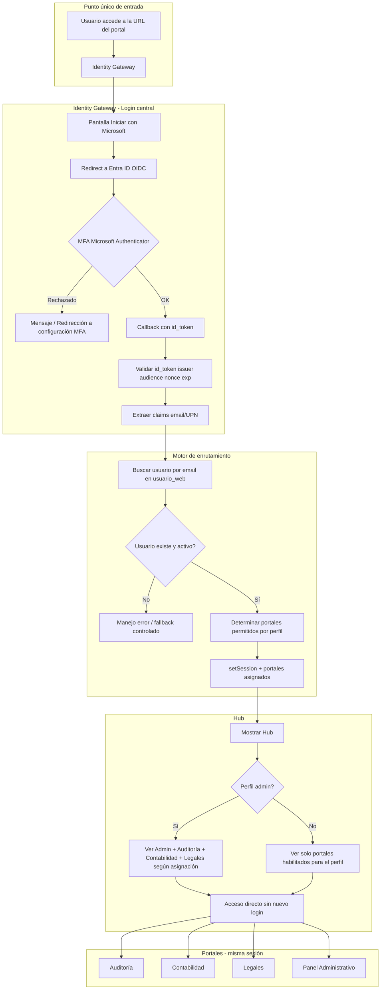

# Plan de Implementación - Portal Unificado con Inicio de Sesión Microsoft (Estimación Final)

---

## 1. Contexto y arquitectura objetivo

- **Un solo login:** Identity Gateway con Microsoft (OIDC) y MFA obligatorio en Entra ID.
- **Un solo punto de entrada:** Cualquier persona entra a la URL del portal, inicia sesión una vez y ve el hub con los portales a los que tiene acceso según su perfil.
- **Portales:** Siguen separados funcionalmente (Auditoría, Contabilidad, Legales). El usuario solo ve y puede acceder a los que su perfil permite; no hay que iniciar sesión en cada uno.

Referencia de código actual: login en [app/Http/Controllers/Seguridad/LoginController.php](app/Http/Controllers/Seguridad/LoginController.php), sesión y roles en [app/Models/Seguridad/Usuario.php](app/Models/Seguridad/Usuario.php), menú por rol en [app/Models/Admin/Menu.php](app/Models/Admin/Menu.php).

---

## 2. Diagrama de flujo propuesto (actualizado)

---

## 3. Estimación final alineada (100 h)

| #   | Fase / Tarea                                                       | Alcance                                                                                                                                                                                                         | Horas   |
| --- | ------------------------------------------------------------------ | --------------------------------------------------------------------------------------------------------------------------------------------------------------------------------------------------------------- | ------- |
| 1   | **Laravel Legacy Auth Assessment**                                 | Auditoría técnica: guards, providers, sesiones, middlewares, rutas `/login`, lógica acoplada y dependencias de sesión. Puntos de intervención para reemplazo por OIDC.                                          | 8       |
| 2   | **Microsoft Entra ID OIDC App Registration & Configuration**       | Registro de aplicación en Entra ID, Redirect URIs, scopes OpenID/profile/email, client secrets, authority endpoint y tenant. Pruebas de callback y validación de id_token.                                      | 10      |
| 3   | **Entra Security Policy Configuration (MFA + Password Policy)**    | Conditional Access para MFA obligatorio (Microsoft Authenticator) y políticas de contraseña/caducidad a nivel tenant. Pruebas con usuarios piloto.                                                              | 6       |
| 4   | **Identity Gateway Implementation (Login central OIDC)**           | Portal central: redirección a Microsoft, callback OIDC, validación de id_token (issuer, audience, nonce, exp), extracción de claims (email/UPN), sesión temporal y logging estructurado.                        | 15      |
| 5   | **Multi-Company Routing Engine (Determinación de portal destino)** | Lógica de enrutamiento según perfil/portal asignado (tabla usuario_portal o equivalente): email → portales permitidos. Allowlist de destinos, anti-open-redirect, usuario activo, manejo de errores y fallback. | 10      |
| 6   | **MFA User Enablement Flow (UX)**                                  | Pantalla informativa y manejo cuando Microsoft exige MFA. Enlaces y pasos para configurar método en el portal de Microsoft. Mensajes accionables. La activación real ocurre en Microsoft.                       | 5       |
| 7   | **Portal 1 – Integración con sesión única**                        | Auditoría: protección de rutas con sesión del gateway, middleware de acceso por portal, compatibilidad con flujo de sesión Laravel.                                                                             | 11      |
| 8   | **Portal 2 – Integración con sesión única**                        | Contabilidad: replicar esquema de protección y middlewares del Portal 1.                                                                                                                                        | 8       |
| 9   | **Portal 3 – Integración con sesión única**                        | Legales: replicar esquema de protección y middlewares del Portal 1.                                                                                                                                             | 8       |
| 10  | **User & Role Normalization**                                      | Correo corporativo como identificador, normalización de usuarios existentes, carga/actualización en tabla de routing (usuario_portal), mapeo roles/permisos por perfil, pruebas de acceso y restricciones.      | 9       |
| 11  | **Legacy Login Decommission & Endpoint Hardening**                 | Deshabilitar pantallas/rutas de login anteriores, redirigir accesos al Identity Gateway, proteger endpoints antiguos, ajuste de enlaces internos y verificación de ausencia de bypass.                          | 5       |
| 12  | **Repository, System Documentation & Evidence Pack**               | Estructura Git, documentación técnica, modelo entidad-relación, matriz de configuraciones (Entra, .env, URLs/callbacks), bitácora de evidencias y documentación final de cambios.                               | 5       |
|     | **TOTAL**                                                          |                                                                                                                                                                                                                 | **100** |

---

## 4. Cambios técnicos (resumen)

- **Login:** Un único Identity Gateway con OIDC (Entra ID). Callback valida id_token y extrae email/UPN; sesión Laravel se establece tras resolver usuario y portales permitidos.
- **Modelo de datos:** Tabla de asignación usuario–portal (p. ej. `usuario_portal` o uso de `area_usuario`/perfil) para el routing; usuario identificado por email en `usuario_web`.
- **Hub:** Vista post-login que muestra solo los portales (Auditoría, Contabilidad, Legales y Admin si aplica) permitidos para el perfil; acceso directo sin nuevo login.
- **Portales (tareas 7–9):** No implementan OIDC propio; comparten la sesión del gateway y se protegen con middleware que verifica perfil/portal asignado.
- **MFA y políticas:** Configuradas en Entra ID (Conditional Access); en Laravel solo UX de orientación (tarea 6).

Archivos clave a crear/modificar: controlador del Identity Gateway (redirect/callback OIDC), controlador/vista del Hub, middleware de acceso por portal, tabla y modelo usuario–portal, rutas y redirección del login legacy.

---

## 5. Orden de implementación sugerido

1. Laravel Legacy Auth Assessment (1)
2. Entra ID OIDC App Registration & Configuration (2)
3. Entra Security Policy Configuration (3)
4. Identity Gateway Implementation (4)
5. MFA User Enablement Flow (6)
6. User & Role Normalization – modelo y tabla de routing (10)
7. Multi-Company Routing Engine – lógica y hub (5)
8. Portal 1 – Integración sesión única (7)
9. Portal 2 – Integración sesión única (8)
10. Portal 3 – Integración sesión única (9)
11. Legacy Login Decommission (11)
12. Repository, Documentation & Evidence Pack (12)

---

## 6. Riesgos y dependencias

- **Entra ID:** La entidad debe registrar la app y proporcionar credenciales (tenant, client_id, client_secret, redirect URI).
- **MFA:** Configuración en Microsoft 365 por parte de la entidad; la app solo redirige y muestra guía (tarea 6).
- **Perfiles y portales:** Definir en panel admin la asignación de portales por usuario/perfil; los correos ya están en Office 365 y visibles en el admin actual.

